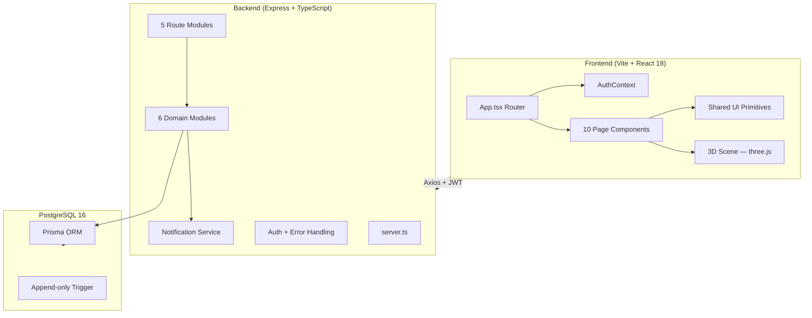
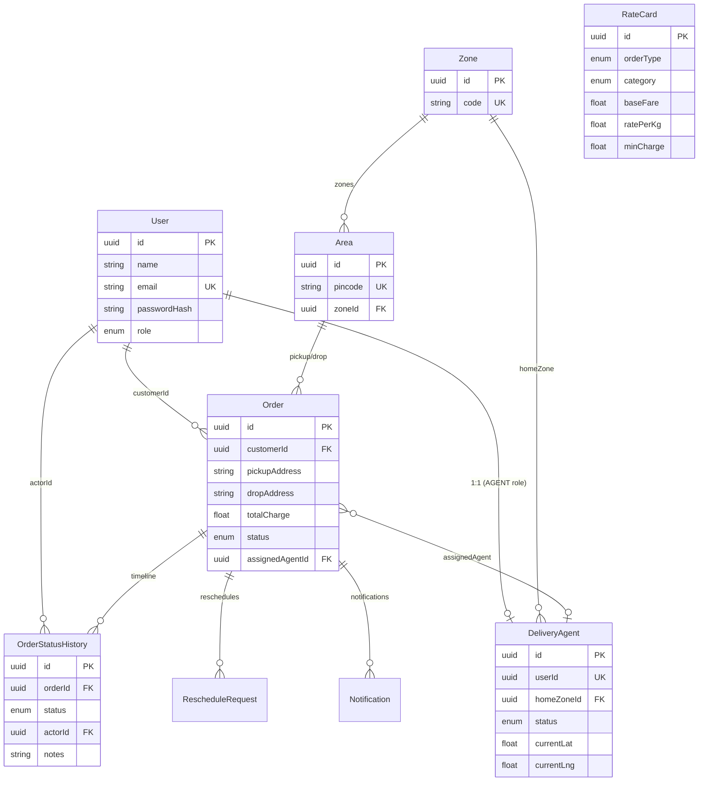
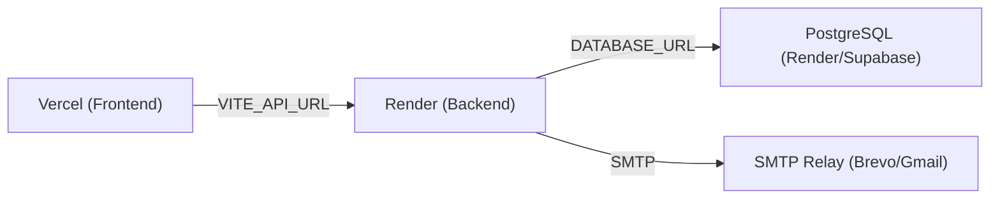

# Last-Mile Delivery Tracker — Full Project Analysis

## Overview

A **full-stack delivery management platform** that handles order creation with auto-calculated shipping charges, intelligent agent assignment, lifecycle tracking with an immutable audit trail, email notifications, and a simulated 3D live-tracking visualization.

---

## Architecture Summary



---

## Tech Stack Breakdown

| Layer | Technology | Version |
|---|---|---|
| **Frontend** | React + TypeScript + Vite | React 18.3, Vite 5.4 |
| **Styling** | Tailwind CSS | 3.4 |
| **3D Visualization** | three.js + @react-three/fiber + drei | three 0.169 |
| **Animation** | framer-motion | 11.11 |
| **Icons** | lucide-react | 0.453 |
| **API Client** | axios | 1.7 |
| **Backend** | Express + TypeScript | Express 4.19, TS 5.6 |
| **ORM** | Prisma | 5.20 |
| **Auth** | JWT + bcryptjs | jsonwebtoken 9.0 |
| **Validation** | Zod | 3.23 |
| **Email** | Nodemailer | 6.9 |
| **Database** | PostgreSQL | 16-alpine |
| **Testing** | Jest + ts-jest | Jest 29.7 |

---

## Codebase Structure

### Backend ([backend/](file:///d:/last_mile_tracker/backend))

```
backend/
├── prisma/
│   ├── schema.prisma          # 10 models, 8 enums, 230 lines
│   ├── seed.ts                # Zones, rate cards, admin + agent
│   ├── immutable-history.sql  # DB-level append-only trigger
│   └── migrations/
├── src/
│   ├── server.ts              # Express entrypoint
│   ├── config/
│   │   ├── db.ts              # PrismaClient singleton
│   │   └── env.ts             # Typed env config
│   ├── middleware/
│   │   ├── auth.ts            # JWT verify, role-based guards
│   │   └── error-handler.ts   # ApiError, Zod, asyncHandler
│   ├── modules/
│   │   ├── auth/              # Register, login, /me
│   │   ├── agents/            # CRUD + status update
│   │   ├── zones/             # Zones + Areas CRUD
│   │   ├── rate-cards/        # Rate cards + COD config upsert
│   │   ├── orders/            # Core domain (4 files)
│   │   │   ├── rate-engine.ts        # Pure charge calculation
│   │   │   ├── assignment-engine.ts  # Pure agent selection
│   │   │   ├── order.service.ts      # Orchestration layer
│   │   │   └── order.routes.ts       # HTTP handlers
│   │   └── notifications/
│   │       ├── notification.channel.ts  # Interface
│   │       ├── email.channel.ts         # SMTP via Nodemailer
│   │       ├── sms.channel.ts           # Stub
│   │       ├── notification.service.ts  # Dispatch + persist
│   │       └── templates.ts             # Status-change copy
│   └── routes/
│       └── index.ts           # Route aggregation
└── tests/
    ├── rate-engine.test.ts    # 20 test cases
    └── assignment-engine.test.ts  # 7 test cases
```

**Total backend**: ~32 source files, ~1,400 lines of application code

### Frontend ([frontend/](file:///d:/last_mile_tracker/frontend))

```
frontend/src/
├── App.tsx                   # Route definitions (11 routes)
├── main.tsx                  # React root
├── types.ts                  # Shared TypeScript interfaces
├── index.css + styles/tailwind.css
├── api/client.ts             # Axios + JWT interceptor
├── context/AuthContext.tsx    # Auth state management
├── hooks/
│   └── useDeliverySimulation.ts  # 3D simulation hook
├── lib/
│   ├── cn.ts                 # clsx + tailwind-merge
│   ├── geo-sim.ts            # Pincode → 3D coordinate hash
│   └── delivery-progress.ts  # Status → route progress
├── components/
│   ├── ui/                   # Button, Card, Input, PageHeader, table
│   ├── layout/StandardLayout.tsx  # Topbar + outlet
│   ├── ProtectedRoute.tsx
│   ├── StatusBadge.tsx
│   ├── 3d/                   # DeliveryScene, RoutePath, Vehicle
│   └── hud/                  # TrackerOverlay, TelemetryCard, etc.
└── pages/
    ├── Login.tsx, Register.tsx
    ├── PlaceOrder.tsx         # Quote + create flow
    ├── MyOrders.tsx           # Customer/Agent order list
    ├── OrderDetail.tsx        # Full detail + status timeline
    ├── LiveTracking.tsx       # 3D scene orchestrator
    └── Admin*.tsx (4 pages)   # Orders, Zones, RateCards, Agents
```

**Total frontend**: ~42 source files, ~2,100 lines of application code

---

## Database Schema



**10 models**, **8 enums**, with well-placed indexes on `status`, `assignedAgentId`, `zoneId`, `pincode`, `orderId`.

---

## Core Domain Logic

### 1. Rate Calculation Engine — [rate-engine.ts](file:///d:/last_mile_tracker/backend/src/modules/orders/rate-engine.ts)

> [!TIP]
> This is the strongest piece of the codebase — pure function, zero side effects, comprehensively tested.

- Volumetric weight: `(L × B × H) / 5000`
- Billable weight: `max(actual, volumetric)`
- Zone category: `INTRA_ZONE` if same zone, else `INTER_ZONE`
- Base charge: `max(baseFare + ratePerKg × billableWeight, minCharge)`
- COD surcharge: flat amount or percentage of base
- **Zero hardcoded rates** — all coefficients come from database

### 2. Assignment Engine — [assignment-engine.ts](file:///d:/last_mile_tracker/backend/src/modules/orders/assignment-engine.ts)

- Filters to `AVAILABLE` agents only
- Prefers home-zone match → Haversine distance ranking → active-order-count tiebreak
- Falls back gracefully when no agent matches
- Also a pure function with no DB access

### 3. Order Lifecycle — [order.service.ts](file:///d:/last_mile_tracker/backend/src/modules/orders/order.service.ts)

```
CREATED → ASSIGNED → PICKED_UP → IN_TRANSIT → OUT_FOR_DELIVERY → DELIVERED
                ↓ (at any stage)
              FAILED → RESCHEDULED → ASSIGNED (re-enters pipeline)
```

- State machine with explicit valid transitions
- Admin can override to any status
- Every transition writes to the append-only `OrderStatusHistory`
- Reschedule is a distinct action that creates a `RescheduleRequest`, clears agent, resets state

### 4. 3D Simulation Layer — [geo-sim.ts](file:///d:/last_mile_tracker/frontend/src/lib/geo-sim.ts) + [delivery-progress.ts](file:///d:/last_mile_tracker/frontend/src/lib/delivery-progress.ts)

- Pincodes are hashed to **deterministic** 3D scene coordinates (FNV-1a hash)
- Route progress derived from `(order.status, statusHistory timestamps, wall-clock time)`
- Three camera modes: Drone (top-down), Chase (behind vehicle), Destination (orbit)
- Lazy-loaded via `React.lazy` — three.js only downloads when `/track/:id` is opened

---

## Security & Auth

| Aspect | Implementation |
|---|---|
| **Password storage** | bcrypt with 10 rounds |
| **Token** | JWT with configurable expiry (default 7d) |
| **Route protection** | `requireAuth` middleware + `requireRole(...)` per route |
| **Frontend guards** | `ProtectedRoute` component with role-based redirect |
| **Ownership checks** | Agents can only update own orders; customers can only see own orders |
| **Data integrity** | Server-side price calculation (client never supplies price) |
| **Audit immutability** | PostgreSQL trigger blocks UPDATE/DELETE on `OrderStatusHistory` |

---

## Test Coverage

### Unit Tests (Jest) — [tests/](file:///d:/last_mile_tracker/backend/tests)

| Suite | File | Test Cases | Coverage |
|---|---|---|---|
| Rate engine | [rate-engine.test.ts](file:///d:/last_mile_tracker/backend/tests/rate-engine.test.ts) | 9 tests | Volumetric weight, zone category, COD surcharge (flat/percentage/null), full charge calc (5 scenarios) |
| Assignment engine | [assignment-engine.test.ts](file:///d:/last_mile_tracker/backend/tests/assignment-engine.test.ts) | 7 tests | Haversine distance, no-agent edge case, zone preference, fallback, geo-nearest, coords-vs-no-coords, load balance |

### Manual Test Guide — [TESTING.md](file:///d:/last_mile_tracker/TESTING.md)

228-line structured manual test plan with:
- Quick smoke test (9 checks)
- Worked rate calculation examples with pre-computed expected values
- Cross-role lifecycle testing (golden path + zone preference + failed/reschedule)
- Negative / access-control tests (7 scenarios)
- DB immutability verification command

---

## Code Quality Assessment

### ✅ Strengths

| Area | Detail |
|---|---|
| **Domain modeling** | Clean separation: pure engines → service orchestration → route handlers |
| **Pure functions** | Both rate and assignment engines are pure, testable, and reused across quote/create |
| **Validation** | Zod schemas at every API boundary; fails early with structured 422 errors |
| **Error handling** | Centralized `ApiError` class + `asyncHandler` wrapper — no uncaught promise rejections |
| **Immutability** | App-layer insert-only + DB-level trigger = defense-in-depth for audit trail |
| **Graceful degradation** | No SMTP? Logs instead. No agent? Order stays unassigned. No rate card? 422, not wrong price. |
| **Code splitting** | three.js bundle is lazy-loaded — only loads for tracking pages |
| **Deterministic simulation** | Same order always renders same route and telemetry — not random noise |
| **Documentation** | README, SYSTEM_DESIGN, TESTING are thorough and accurate to the code |
| **Seed data** | Comprehensive seed script with upserts (idempotent) |

### ⚠️ Areas for Improvement

| Area | Detail | Severity |
|---|---|---|
| **No pagination** | `listOrders` returns all matching orders — will degrade at scale | Medium |
| **Missing API rate limiting** | No rate limiting middleware on auth endpoints | Medium |
| **No refresh token** | Single JWT with 7-day expiry; no refresh flow; 401 just clears localStorage | Low |
| **Missing `DELETE` endpoints** | No way to delete zones, areas, agents, or orders via API | Low |
| **Reschedule hardcodes `CUSTOMER` role** | [order.service.ts L332](file:///d:/last_mile_tracker/backend/src/modules/orders/order.service.ts#L332) always sets `actorRole: Role.CUSTOMER` even when admin reschedules | Bug |
| **No input sanitization** | Address strings aren't sanitized/trimmed beyond Zod `.min(1)` | Low |
| **No request logging** | No Morgan/Pino middleware for request logging in production | Low |
| **Frontend has no error boundaries** | React errors in 3D scene could crash the entire app | Medium |
| **Auth context reads localStorage synchronously** | May flash wrong UI on hydration | Low |
| **No CI/CD pipeline** | No GitHub Actions / Dockerfile for the app itself | Low |
| **Missing frontend tests** | Only backend has tests; no component or integration tests for the frontend | Medium |
| **`tsconfig.json` not strict** | Backend `tsconfig` may not have `strict: true` | Low |

---

## API Surface Summary

| Module | Routes | Auth | Methods |
|---|---|---|---|
| **Auth** | `/auth/register`, `/auth/login`, `/auth/me` | Open / Open / Any | POST, POST, GET |
| **Zones** | `/zones`, `/zones/:id`, `/zones/areas`, `/zones/areas/:id` | Any / Admin / Any / Admin | GET+POST, PUT, GET+POST, PUT |
| **Rate Cards** | `/rate-cards`, `/rate-cards/cod-surcharge` | Any / Admin | GET+PUT, GET+PUT |
| **Agents** | `/agents`, `/agents/:id/status` | Admin / Admin+Agent | GET+POST, PUT |
| **Orders** | `/orders/quote`, `/orders`, `/orders/:id`, `/orders/:id/assign`, `/orders/:id/auto-assign`, `/orders/:id/status`, `/orders/:id/reschedule` | Any, Any, Any, Admin, Admin, Agent+Admin, Customer+Admin | POST, GET+POST, GET, PUT, POST, PUT, POST |

**Total: 18 endpoints across 5 modules**

---

## Frontend Routing

| Route | Component | Access |
|---|---|---|
| `/` | Home (redirect) | Auto-redirects by role |
| `/login` | Login | Public |
| `/register` | Register | Public |
| `/orders/new` | PlaceOrder | Customer, Admin |
| `/orders` | MyOrders | Customer, Agent |
| `/orders/:id` | OrderDetail | Any authenticated |
| `/track/:id` | LiveTracking (lazy) | Any authenticated |
| `/admin/orders` | AdminOrders | Admin |
| `/admin/zones` | AdminZones | Admin |
| `/admin/rate-cards` | AdminRateCards | Admin |
| `/admin/agents` | AdminAgents | Admin |

---

## Deployment Architecture



---

## Key File Quick Reference

| Purpose | File |
|---|---|
| Database schema | [schema.prisma](file:///d:/last_mile_tracker/backend/prisma/schema.prisma) |
| Rate calculation | [rate-engine.ts](file:///d:/last_mile_tracker/backend/src/modules/orders/rate-engine.ts) |
| Agent assignment | [assignment-engine.ts](file:///d:/last_mile_tracker/backend/src/modules/orders/assignment-engine.ts) |
| Order orchestration | [order.service.ts](file:///d:/last_mile_tracker/backend/src/modules/orders/order.service.ts) |
| API routes | [order.routes.ts](file:///d:/last_mile_tracker/backend/src/modules/orders/order.routes.ts) |
| Auth middleware | [auth.ts](file:///d:/last_mile_tracker/backend/src/middleware/auth.ts) |
| Notification dispatch | [notification.service.ts](file:///d:/last_mile_tracker/backend/src/modules/notifications/notification.service.ts) |
| Frontend entry | [App.tsx](file:///d:/last_mile_tracker/frontend/src/App.tsx) |
| 3D geo simulation | [geo-sim.ts](file:///d:/last_mile_tracker/frontend/src/lib/geo-sim.ts) |
| Delivery progress | [delivery-progress.ts](file:///d:/last_mile_tracker/frontend/src/lib/delivery-progress.ts) |
| Frontend types | [types.ts](file:///d:/last_mile_tracker/frontend/src/types.ts) |
| Seed data | [seed.ts](file:///d:/last_mile_tracker/backend/prisma/seed.ts) |
| Immutable trigger | [immutable-history.sql](file:///d:/last_mile_tracker/backend/prisma/immutable-history.sql) |

---

## Summary Statistics

| Metric | Value |
|---|---|
| Total source files | ~74 |
| Backend lines of code | ~1,400 |
| Frontend lines of code | ~2,100 |
| Database tables | 10 |
| API endpoints | 18 |
| Frontend routes | 11 |
| Unit tests | 16 |
| Manual test scenarios | 30+ |
| Prisma enums | 8 |
| npm dependencies (backend) | 7 runtime + 10 dev |
| npm dependencies (frontend) | 11 runtime + 8 dev |
